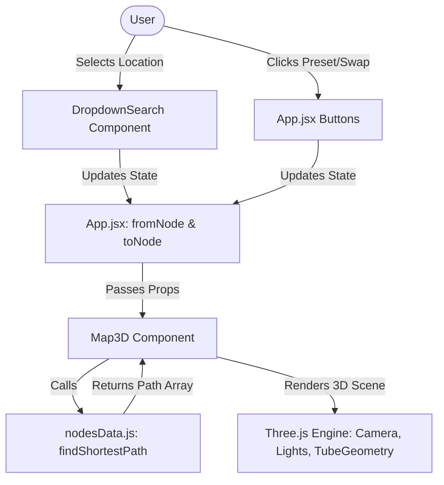

# Complete Line-by-Line & Function-by-Function Code Documentation

This document provides an in-depth breakdown of every file, function, state variable, and line of logic in your 3D Map navigation application.

---

## 🏛️ 1. Architecture Overview



---

## 📂 2. Data & Pathfinding: `src/nodesData.js`

File: [src/nodesData.js](file:///d:/MERN/my-first-react-app/src/nodesData.js)

### 2.1 The `NODES` Array
```js
export const NODES = [
  { id: 'Apple', name: 'Apple Zone (Entrance)', x: -12, y: 0.2, z: -10, color: '#ff4d4d' },
  ...
];
```
- **Purpose**: Defines every map location as an object.
- **Fields**:
  - `id`: Unique string identifier used across the app (e.g. `'Apple'`).
  - `name`: Display title shown in dropdown menus and UI overlays.
  - `x`, `y`, `z`: 3D Cartesian coordinates in Three.js world space.
    - `x`: Horizontal axis (-16 to +16).
    - `y`: Vertical height above ground floor (`0.2` elevates markers slightly above ground).
    - `z`: Depth axis (-16 to +16).
  - `color`: Hex color string assigned to the pin marker.

---

### 2.2 The `EDGES` Array
```js
const EDGES = [
  ['Apple', 'Banana'],
  ['Apple', 'Fig'],
  ...
];
```
- **Purpose**: Represents walkable corridors/connections between nodes.
- **Format**: An array of 2-element tuples `[NodeA_ID, NodeB_ID]`. For example, `['Apple', 'Banana']` means a pathway exists directly between Apple Zone and Banana Plaza.

---

### 2.3 `getDistance(n1, n2)` Function
```js
function getDistance(n1, n2) {
  const dx = n1.x - n2.x;
  const dy = n1.y - n2.y;
  const dz = n1.z - n2.z;
  return Math.sqrt(dx * dx + dy * dy + dz * dz);
}
```
- **Purpose**: Calculates the Euclidean distance between two 3D node points in 3D space ($d = \sqrt{\Delta x^2 + \Delta y^2 + \Delta z^2}$). Used as edge weights in graph navigation.

---

### 2.4 Graph Adjacency List Construction
```js
const adjacencyList = {};
NODES.forEach(node => {
  adjacencyList[node.id] = [];
});

EDGES.forEach(([fromId, toId]) => {
  const nodeA = NODES.find(n => n.id === fromId);
  const nodeB = NODES.find(n => n.id === toId);
  if (nodeA && nodeB) {
    const dist = getDistance(nodeA, nodeB);
    adjacencyList[fromId].push({ id: toId, weight: dist });
    adjacencyList[toId].push({ id: fromId, weight: dist });
  }
});
```
- **Line-by-Line Breakdown**:
  1. Initializes `adjacencyList` dictionary with empty arrays for every node ID.
  2. Iterates over `EDGES` to locate both node objects in `NODES`.
  3. Computes 3D distance `dist`.
  4. Pushes neighbor objects `{ id, weight }` to both nodes (undirected graph representation).

---

### 2.5 `findShortestPath(startNodeId, endNodeId)` Function
Uses **Dijkstra's Algorithm** to calculate the shortest path between any two nodes.

```js
export function findShortestPath(startNodeId, endNodeId) {
  if (!startNodeId || !endNodeId) return [];
  if (startNodeId === endNodeId) {
    const node = NODES.find(n => n.id === startNodeId);
    return node ? [node] : [];
  }
```
- **Guard Clauses**: Returns empty array if inputs are missing; returns single node if start equals end.

```js
  const distances = {};
  const previous = {};
  const unvisited = new Set();

  NODES.forEach(node => {
    distances[node.id] = Infinity;
    previous[node.id] = null;
    unvisited.add(node.id);
  });

  distances[startNodeId] = 0;
```
- **Initialization**:
  - `distances`: Tracks shortest distance from start node to every other node (initialized to $\infty$).
  - `previous`: Tracks previous node in optimal path for back-tracing.
  - `unvisited`: Set of unvisited node IDs.
  - Sets distance to `startNodeId` to `0`.

```js
  while (unvisited.size > 0) {
    let currentId = null;
    let smallestDist = Infinity;

    unvisited.forEach(id => {
      if (distances[id] < smallestDist) {
        smallestDist = distances[id];
        currentId = id;
      }
    });

    if (currentId === null || currentId === endNodeId) break;

    unvisited.delete(currentId);
```
- **Main Loop**:
  - Selects unvisited node with smallest calculated distance.
  - Stops if destination `endNodeId` is reached or unreachable.

```js
    const neighbors = adjacencyList[currentId] || [];
    for (const neighbor of neighbors) {
      if (unvisited.has(neighbor.id)) {
        const newDist = distances[currentId] + neighbor.weight;
        if (newDist < distances[neighbor.id]) {
          distances[neighbor.id] = newDist;
          previous[neighbor.id] = currentId;
        }
      }
    }
  }
```
- **Relaxation**: Checks all neighbors of `currentId`. If a shorter path to neighbor is found via `currentId`, update distance and previous pointer.

```js
  // Reconstruct path
  const path = [];
  let curr = endNodeId;
  if (distances[endNodeId] === Infinity) return []; // No path found

  while (curr !== null) {
    const node = NODES.find(n => n.id === curr);
    if (node) path.unshift(node);
    curr = previous[curr];
  }

  return path;
}
```
- **Back-tracing**: Walks backwards from `endNodeId` using `previous` pointers and unshifts node objects to form an ordered array from `startNodeId` $\rightarrow$ `endNodeId`.

---

## 🎨 3. 3D Renderer & Viewport: `src/Map3D.jsx`

File: [src/Map3D.jsx](file:///d:/MERN/my-first-react-app/src/Map3D.jsx)

### 3.1 `createMapTexture()` Function
Generates a dynamic 2048x2048 HTML5 Canvas floorplan texture rendered onto the 3D ground plane.

```js
function createMapTexture() {
  const canvas = document.createElement('canvas');
  canvas.width = 2048;
  canvas.height = 2048;
  const ctx = canvas.getContext('2d');
```
- Creates an off-screen HTML5 canvas element.

```js
  // Background gradient
  const gradient = ctx.createRadialGradient(1024, 1024, 100, 1024, 1024, 1200);
  gradient.addColorStop(0, '#0f172a');
  gradient.addColorStop(1, '#020617');
  ctx.fillStyle = gradient;
  ctx.fillRect(0, 0, 2048, 2048);
```
- Draws a subtle radial dark-blue to dark-slate background.

```js
  // Draw Grid Lines
  ctx.strokeStyle = 'rgba(56, 189, 248, 0.08)';
  ctx.lineWidth = 2;
  const step = 64;
  for (let x = 0; x <= 2048; x += step) { ... }
```
- Renders cyan grid lines across the map.

```js
  const mapToCanvas = (val) => ((val + 16) / 32) * 2048;
```
- **Coordinate Conversion**: Maps 3D world space coordinates ($[-16, 16]$) to 2D Canvas pixel coordinates ($[0, 2048]$).

```js
  NODES.forEach((node) => {
    const cx = mapToCanvas(node.x);
    const cz = mapToCanvas(node.z);
    // Draw zone glow circles & borders on map floor
  });
```
- Draws glowing floor rings under every location.

---

### 3.2 The `Map3D` Component Setup
```js
export default function Map3D({ fromNode, toNode }) {
  const mountRef = useRef(null);      // Canvas container div ref
  const sceneRef = useRef(null);      // Three.js Scene instance ref
  const controlsRef = useRef(null);   // OrbitControls instance ref
  const pathMeshRef = useRef(null);   // 3D Path Tube Mesh ref
  const pathAnimRef = useRef(null);   // Path Canvas Texture ref (for flow animation)
  const nodePinsRef = useRef({});     // Map of 3D Pin groups by node ID
```
- **Refs**: Used to hold Three.js instances across React renders without causing re-renders.

---

### 3.3 Initializing Three.js Scene (`useEffect` #1)
Executes once when component mounts.

1. **Scene Creation**:
   ```js
   const scene = new THREE.Scene();
   scene.background = new THREE.Color('#090d16');
   scene.fog = new THREE.FogExp2('#090d16', 0.015);
   ```
   - Sets background color and subtle distance fog.

2. **Perspective Camera**:
   ```js
   const camera = new THREE.PerspectiveCamera(45, width / height, 0.1, 1000);
   camera.position.set(0, 24, 30);
   ```
   - 45° field of view, positioned angled looking down at the map.

3. **WebGL Renderer & Shadows**:
   ```js
   const renderer = new THREE.WebGLRenderer({ antialias: true, alpha: true });
   renderer.setSize(width, height);
   renderer.shadowMap.enabled = true;
   renderer.shadowMap.type = THREE.PCFSoftShadowMap;
   ```
   - Enables anti-aliasing and PCF soft shadow maps.

4. **OrbitControls**:
   ```js
   const controls = new OrbitControls(camera, renderer.domElement);
   controls.enableDamping = true;      // Inertial movement
   controls.dampingFactor = 0.05;
   controls.maxPolarAngle = Math.PI / 2 - 0.05; // Prevents camera going under ground
   ```

5. **Lighting**:
   - `AmbientLight` (fill light).
   - `DirectionalLight` (key light casting soft shadows).
   - `PointLight` (center accent light).

6. **Ground Plane Mesh**:
   ```js
   const groundPlane = new THREE.Mesh(planeGeo, planeMat);
   groundPlane.rotation.x = -Math.PI / 2; // Flat on ground
   ```

7. **3D Node Pins Creation**:
   - For each node:
     - Glassy 3D base cylinder (`CylinderGeometry`).
     - Pin head sphere (`SphereGeometry`).
     - Pin stem cone (`ConeGeometry`).
     - Pulsing floor ring (`RingGeometry`).

8. **Animation Loop (`requestAnimationFrame`)**:
   ```js
   const animate = () => {
     animationFrameId = requestAnimationFrame(animate);
     const elapsedTime = clock.getElapsedTime();
     
     // Floating pin animation
     pinHead.position.y = 1.8 + Math.sin(elapsedTime * 2 + idx) * 0.1;
     
     // Path texture flow animation
     if (pathAnimRef.current) {
       pathAnimRef.current.offset.x -= 0.02;
     }
     
     controls.update();
     renderer.render(scene, camera);
   };
   ```

---

### 3.4 Dynamic Route Calculation & Path Drawing (`useEffect` #2)
Executes whenever `fromNode` or `toNode` props change.

1. **Clean Up Old Path**:
   ```js
   if (pathMeshRef.current) {
     scene.remove(pathMeshRef.current);
     pathMeshRef.current.geometry.dispose();
     pathMeshRef.current.material.dispose();
   }
   ```
   - Prevents memory leaks by disposing of old geometry and materials.

2. **Pin Highlighting**:
   - Highlights `fromNode` pin in vibrant emerald green (`#00ff88`).
   - Highlights `toNode` pin in glowing coral red (`#ff3366`).
   - Scales active pins up by 30%.

3. **3D Smooth Curve Generation (`CatmullRomCurve3`)**:
   ```js
   const points = pathNodes.map((n) => new THREE.Vector3(n.x, 0.4, n.z));
   const curve = new THREE.CatmullRomCurve3(points, false, 'catmullrom', 0.2);
   ```
   - Fits a smooth 3D spline curve through the calculated node points.

4. **3D Tube Mesh (`TubeGeometry`)**:
   ```js
   const tubeGeo = new THREE.TubeGeometry(curve, pathNodes.length * 20, 0.25, 12, false);
   ```
   - Extrudes a 3D tube with radius `0.25` along the curve.

5. **Animated Flow Texture**:
   - Creates a gradient texture with forward directional arrows.
   - Sets texture wrapping to repeat, enabling smooth sliding flow in the animation loop.

---

## ⚡ 4. App Component & State Management: `src/App.jsx`

File: [src/App.jsx](file:///d:/MERN/my-first-react-app/src/App.jsx)

### 4.1 State Declaration
```js
const [fromNode, setFromNode] = useState('Apple');
const [toNode, setToNode] = useState('Lemon');
```
- `fromNode`: ID of starting location (defaults to `'Apple'`).
- `toNode`: ID of destination location (defaults to `'Lemon'`).

### 4.2 Dropdown Component Controlled Inputs
```js
<DropdownSearch
  label="Starting Node (From):"
  value={fromNode}
  onChange={setFromNode}
  placeholder="Type start location..."
/>
```
- Passes `fromNode` as controlled value and `setFromNode` as change handler.

### 4.3 Swap & Preset Buttons
```js
// Swap Button
onClick={() => {
  const temp = fromNode;
  setFromNode(toNode);
  setToNode(temp);
}}

// Preset Button
const setPresetRoute = (start, end) => {
  setFromNode(start);
  setToNode(end);
};
```

---

## 📊 Summary Table of Key Files

| File | Type | Primary Responsibility |
| :--- | :--- | :--- |
| [nodesData.js](file:///d:/MERN/my-first-react-app/src/nodesData.js) | JS Data & Logic | Stores 3D map nodes coordinates, edge connections, and executes Dijkstra shortest-path algorithm |
| [Map3D.jsx](file:///d:/MERN/my-first-react-app/src/Map3D.jsx) | React Component | Initializes Three.js WebGL scene, ground plane, 3D pins, animated tube pathing, and OrbitControls |
| [Map3D.css](file:///d:/MERN/my-first-react-app/src/Map3D.css) | CSS | Styles the 3D viewport canvas container, top toolbar buttons, and floating route info cards |
| [App.jsx](file:///d:/MERN/my-first-react-app/src/App.jsx) | React Component | Main dashboard layout, manages `fromNode` / `toNode` state, navbar, search dropdowns, and quick route presets |
| [DropdownSearch.css](file:///d:/MERN/my-first-react-app/src/DropdownSearch.css) | CSS | Dark glass styling for interactive searchable location dropdowns |
| [asset.css](file:///d:/MERN/my-first-react-app/src/asset.css) | CSS | Global dashboard flexbox layout (`.main`, `.left`, `.right`, `.up`, `.down`) |
